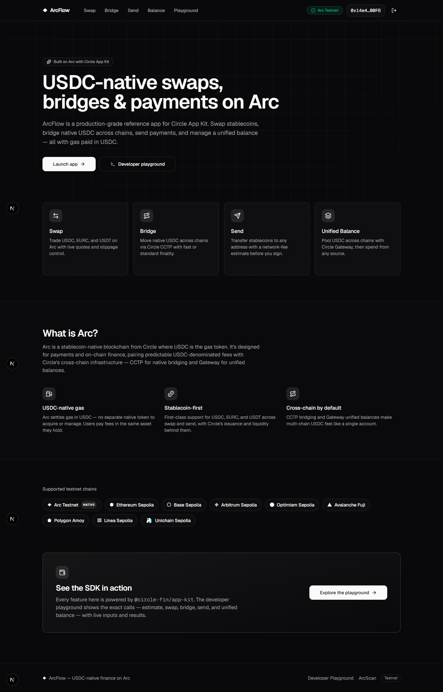
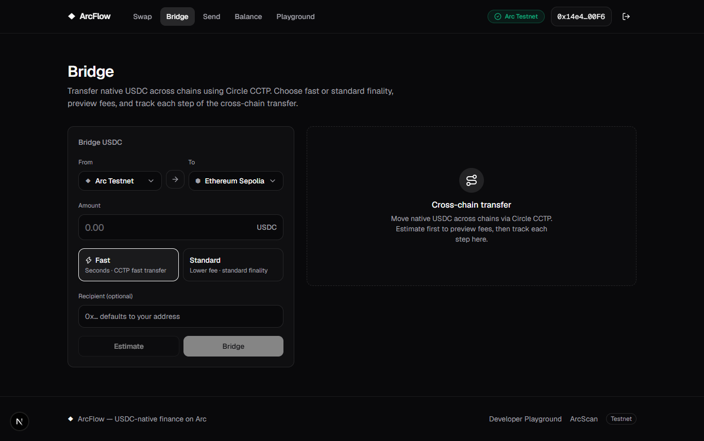
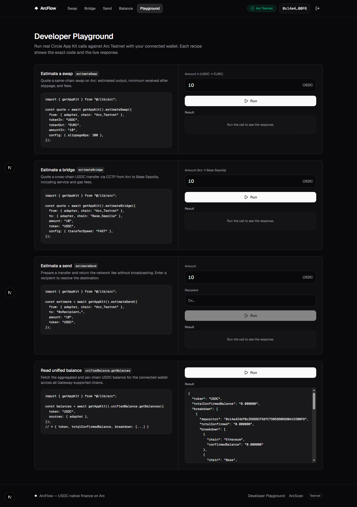

# ArcFlow — USDC-native dashboard on Arc

ArcFlow is a production-grade Next.js dashboard that demonstrates Circle's **Arc App Kit** end to end. It gives developers a clean, typed reference implementation for the four core stablecoin flows on **Arc Testnet** — **Swap, Bridge, Send, and Unified Balance** — plus a **Developer Playground** that fires real App Kit calls against the connected wallet and shows you both the exact code and the live JSON response.

Everything runs on USDC-native gas. There is no separate gas token to manage — fees are paid in USDC, which is what makes Arc interesting for stablecoin apps.

> **Status:** feature-complete reference app. TypeScript strict, ESLint clean, and a full production build (all routes static-prerendered) all pass.

---

## Table of contents

- [What it does](#what-it-does)
- [Tech stack](#tech-stack)
- [Project structure](#project-structure)
- [Prerequisites](#prerequisites)
- [Quick start](#quick-start)
- [Environment variables](#environment-variables)
- [Using the app](#using-the-app)
- [The Developer Playground](#the-developer-playground)
- [Testing & verification](#testing--verification)
- [Production build & deployment](#production-build--deployment)
- [How it works (architecture)](#how-it-works-architecture)
- [Troubleshooting](#troubleshooting)

---

## What it does

| Route         | Feature                  | What you can do                                                                                                                              |
| ------------- | ------------------------ | -------------------------------------------------------------------------------------------------------------------------------------------- |
| `/`           | **Landing**              | Overview of Arc, the feature set, supported chains, and a developer CTA.                                                                     |
| `/swap`       | **Swap**                 | Estimate and execute a same-chain token swap on Arc Testnet (e.g. USDC → EURC) via `AppKit.swap`.                                            |
| `/bridge`     | **Bridge**               | Move USDC cross-chain using Circle CCTP, with a live multi-step progress panel and explorer links.                                           |
| `/send`       | **Send**                 | Estimate fees/gas and send USDC to any EVM address on a chosen chain.                                                                        |
| `/balance`    | **Unified Balance**      | Read an aggregated USDC balance across Gateway-supported chains, deposit into the unified balance, and spend from multiple sources at once.  |
| `/playground` | **Developer Playground** | Run real App Kit calls (`estimateSwap`, `estimateBridge`, `estimateSend`, `getBalances`) and inspect the responses next to the exact source. |

Feature pages gate on a connected wallet — until you connect, you'll see a "Connect your wallet" prompt rather than an empty form.

---

## Tech stack

- **Framework:** [Next.js 15](https://nextjs.org) (App Router, React 19, server + client components)
- **Language:** TypeScript (strict)
- **Circle Arc App Kit:** [`@circle-fin/app-kit`](https://www.npmjs.com/package/@circle-fin/app-kit) + [`@circle-fin/adapter-viem-v2`](https://www.npmjs.com/package/@circle-fin/adapter-viem-v2)
- **Wallet / chain:** [wagmi](https://wagmi.sh) + [viem](https://viem.sh)
- **Data / async state:** [TanStack Query](https://tanstack.com/query)
- **UI:** [Tailwind CSS](https://tailwindcss.com), [shadcn/ui](https://ui.shadcn.com) (Radix primitives), [framer-motion](https://www.framer.com/motion/), [lucide-react](https://lucide.dev), [Geist](https://vercel.com/font)
- **Validation:** [zod](https://zod.dev)

---

## Project structure

```
arc-developer-dashboard/
├── app/                      # Next.js App Router routes
│   ├── page.tsx              # Landing (/)
│   ├── swap/ bridge/ send/   # Feature routes
│   ├── balance/ playground/  # Unified balance + live playground
│   ├── layout.tsx            # Root layout, providers, fonts, nav
│   └── globals.css
├── features/                 # Feature modules (UI + hooks colocated)
│   ├── swap/  bridge/  send/
│   ├── unified-balance/      # balance / deposit / spend cards + hook
│   ├── landing/              # marketing landing
│   └── playground/           # live App Kit recipes
├── components/
│   ├── arc/                  # Arc-specific inputs (token select, etc.)
│   ├── wallet/               # wallet connect UI
│   ├── layout/               # site nav, feature shell
│   └── ui/                   # shadcn/ui primitives
├── lib/arc/                  # Core Arc + App Kit layer
│   ├── kit.ts                # AppKit singleton + viem adapter wiring
│   ├── chains.ts             # supported chains + chainsFor(feature)
│   ├── tokens.ts             # supported tokens + tokensFor(feature)
│   ├── format.ts             # formatToken, shortenHash, chainLabel …
│   ├── errors.ts             # toUserMessage(error)
│   └── index.ts              # public barrel export
├── .env.example              # copy to .env.local
└── package.json
```

Each feature keeps its hook (`use-*.ts`) next to its components, so the data flow for a feature is readable in one folder.

---

## Prerequisites

- **Node.js ≥ 20.9.0** (see `engines` in `package.json`)
- **npm** (or pnpm/yarn — examples below use npm)
- A browser wallet (e.g. MetaMask) with **Arc Testnet** added, funded with testnet USDC for live transactions. Read-only estimates work without funds.

---

## Quick start

```bash
# 1. install dependencies
npm install

# 2. configure environment
cp .env.example .env.local
#    then edit .env.local (see the table below — all values have safe defaults except optional keys)

# 3. run the dev server
npm run dev
#    open http://localhost:3000
```

That's it for local development. Connect your wallet on any feature page to start making live calls.

---

## Environment variables

Copy `.env.example` to `.env.local`. Only public (`NEXT_PUBLIC_*`) values are used — there are **no server secrets** in this app, so nothing here is sensitive, but `.env.local` is gitignored regardless.

| Variable                               | Required       | Purpose                                                                                                                             |
| -------------------------------------- | -------------- | ----------------------------------------------------------------------------------------------------------------------------------- |
| `NEXT_PUBLIC_ARC_CHAIN_ID`             | ✅ (defaulted) | Arc Testnet chain id — `5042002`.                                                                                                   |
| `NEXT_PUBLIC_ARC_EXPLORER_URL`         | ✅ (defaulted) | Block explorer base — `https://testnet.arcscan.app`.                                                                                |
| `NEXT_PUBLIC_ARC_PRIMARY_RPC_URL`      | optional       | Override the primary Arc RPC. Empty → viem's built-in Arc Testnet RPCs. Set a private endpoint for stability.                       |
| `NEXT_PUBLIC_WALLETCONNECT_PROJECT_ID` | optional       | [WalletConnect Cloud](https://cloud.walletconnect.com) id. Empty → only injected/browser wallets are offered.                       |
| `NEXT_PUBLIC_CIRCLE_KIT_KEY`           | optional       | Circle App Kit key from the [Circle Console](https://console.circle.com). Optional for estimates/swaps; recommended for production. |

The app runs out of the box with the defaults — the optional keys just unlock WalletConnect and production-grade Circle access.

---

## Using the app

1. **Connect a wallet.** Click _Connect_ in the top nav. Injected wallets (MetaMask, etc.) always work; WalletConnect appears if you set a project id.
2. **Swap** (`/swap`): pick a from/to token and amount, click **Estimate** to preview the quote, then **Swap** to execute. Swaps are anchored to Arc Testnet.
3. **Bridge** (`/bridge`): choose source and destination chains and a USDC amount. **Estimate** previews the CCTP quote; **Bridge** executes and streams a multi-step progress panel (each step links to the explorer). Bridge is USDC-only.
4. **Send** (`/send`): choose a chain and token, enter a recipient EVM address and amount. The address is validated inline; **Estimate** shows fee + gas, **Send** submits.
5. **Unified Balance** (`/balance`):
   - **Balance** — aggregated confirmed USDC plus a per-chain / per-account breakdown, with a refresh button.
   - **Deposit** — move USDC from one chain into your Gateway unified balance.
   - **Spend** — draw from multiple source chains in a single spend, to a destination chain (optionally to a specific recipient).

All actions surface success/failure as toasts, and errors are run through `toUserMessage()` so you see a readable message rather than a raw SDK error.

---

## The Developer Playground

`/playground` is the fastest way to understand the SDK. Each recipe:

- shows the **exact code** that produces the call, and
- runs the **real hook** against your connected wallet, rendering the live JSON result (or a friendly error).

Recipes included:

| Recipe          | App Kit method               | Example                            |
| --------------- | ---------------------------- | ---------------------------------- |
| Swap            | `swap.estimateSwap`          | USDC → EURC on Arc                 |
| Bridge          | `bridge.estimateBridge`      | Arc → Base Sepolia                 |
| Send            | `send.estimateSend`          | requires a valid recipient address |
| Unified balance | `unifiedBalance.getBalances` | aggregated USDC across chains      |

These are read-only estimates/reads, so they're safe to run repeatedly without spending funds.

---

## Testing & verification

The repo ships with the same checks used to verify it. Run them from the project root:

```bash
npm run typecheck    # tsc --noEmit — strict type check, must be clean
npm run lint         # eslint . — must be clean
npm run format:check # prettier --check .
npm run build        # next build — production build, all routes prerender
```

**Manual smoke test** (against the production build):

```bash
npm run build
npm run start           # serves on http://localhost:3000
# in another shell:
curl -s -o /dev/null -w "%{http_code}\n" http://localhost:3000/          # 200
curl -s -o /dev/null -w "%{http_code}\n" http://localhost:3000/swap      # 200
curl -s -o /dev/null -w "%{http_code}\n" http://localhost:3000/does-not-exist  # 404
```

All six routes (`/`, `/swap`, `/bridge`, `/send`, `/balance`, `/playground`) return **200**, and unknown routes return **404**.

> **Windows note:** if `next build` throws `Cannot read properties of null (reading 'useContext')` during the `/404` prerender, run the build from the canonically-cased path (`C:\Users\...` with a capital `U`). A lowercase `c:\users\...` cwd makes webpack load React twice. Delete `.next` and rebuild from the correct casing.

---

## Production build & deployment

The app is a standard Next.js App Router project and deploys cleanly to **Vercel** or any Node-compatible Next.js host.

1. Set the environment variables (at minimum the two Arc defaults; add WalletConnect / Circle keys for production).
2. `npm run build`
3. `npm run start` (or deploy to Vercel, which runs build automatically).

All routes are statically prerendered where possible; client-only feature logic hydrates on the client.

---

## How it works (architecture)

- **`lib/arc/kit.ts`** constructs a single `AppKit` instance and bridges the wagmi EIP-1193 provider into App Kit through `@circle-fin/adapter-viem-v2`. Every feature hook calls into this one adapter.
- **`chainsFor(feature)` / `tokensFor(feature)`** (`lib/arc`) filter the UI to exactly what each feature supports — e.g. Bridge and Unified Balance are USDC-only, and Unified Balance is limited to Gateway-supported chains. This keeps invalid combinations off-screen and lets the hooks trust their inputs at the SDK boundary.
- **Feature hooks** (`features/*/use-*.ts`) wrap App Kit methods in TanStack Query `useMutation`/`useQuery`, exposing typed form state, estimate, and execute functions. UI components stay declarative.
- **Errors** funnel through `toUserMessage()` so SDK errors become readable text.

---

## Troubleshooting

- **"Connect your wallet" won't go away** — make sure your wallet is on **Arc Testnet** (chain id `5042002`) and actually connected via the nav button.
- **No WalletConnect option** — set `NEXT_PUBLIC_WALLETCONNECT_PROJECT_ID` in `.env.local`.
- **RPC rate-limited / flaky** — set `NEXT_PUBLIC_ARC_PRIMARY_RPC_URL` to a private endpoint.
- **Live transactions fail** — confirm the connected wallet holds testnet USDC (used for both the transfer and gas).
- **Windows `useContext` build error** — see the Windows note under [Testing & verification](#testing--verification).

---

## Screenshots

### Landing Page



### Swap


### Bridge



### Developer Playground



## Demo

Watch ArcFlow in action:

[▶ Demo Video](https://youtu.be/FZTOnYo86E8)

---

Built with Circle Arc App Kit. Not affiliated with Circle; for testnet/demonstration use.
